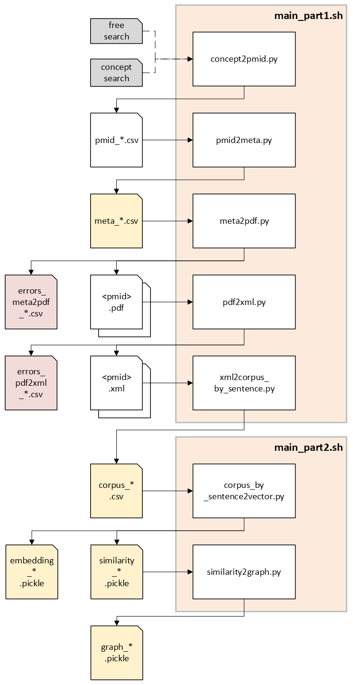

**Open Knowledge Explorer**

Please find the github page containing [the code over here](https://github.com/CharmingChocobo/master_graduation_project/tree/main) and
check out [this extensive documentation page](https://bioinf.nl/~jbeenen/oke/html/index.html).

## TODO: About this project

Note that 'concept' search mode is currently hard-coded to anchor with "Parkinson's Disease". This it is advised to use the 'free' search mode if this is not applicable to your research question.

https://apimlqv2.tenwiseservice.nl/html/index.html

## How to use
- Create an venv and install the dependent libraries. Please find used Python version and libraries in the section 'Requirements'.
- Make sure initial folder structure is present. Please view section 'Folder structure' in this readme.
- Change the filename of `config_template.yaml` to `config.yaml`, and change the variables accordingly.
- Change settings in `main_part1.sh` and `main_part2.sh`. Make sure they both use the same settings and check if pipes of interest are active.
- If pdf2xml.py is active in `main_part1.sh`; make sure to activate the GROBID server by running `bash start_grobid_a19.sh` first, before running `main_part1.sh`. (Check with `curl <servername>:<portname>` if GROBID is alive.)

**NOTE: There are two separate 'main' scripts. `main_part1.sh` runs on assemblix2019 (CPU heavy) and `main_part2.sh` runs on assemblix2025 (GPU heavy). For GROBID to work, run `start_grobid_a19.sh` on the same device as `main_part1.sh` will be running.**

- Run the application by entering `bash main_part1.sh && sbatch main_part2.sh` in the terminal. Log files will be create and can be found in `logs/`.
  
**WARNING: Path to where data will be written (`data/`) is currently hard-coded. Make sure that there is enough disk space to avoid disappointments. Please view section 'Storage requirements' in this readme for more information.**

- Use the jupyter notebooks in folder `explorations` to analyze created sentence embedding, similarity scores, and networkx graph. Note that these notebooks contain code that is specific for our "Parkinson's - Pesticide" research question. Please modify the code as you see fit.

## Configuration
Please use `config.yaml` to modify the configuration. Note that the parenthesis denotes for which script they are required.

**Tenwise credentials (concept2pmid, pmid2meta)**
- "path_to_credentials": "path/to/credentials"
- "email_address": "user@domain.com"

**Search settings (concept2pmid)**
- **concept search**
- "path_to_concept_ids": "path/to/all_pesticide_concept_ids.tsv"
- **free search**
- "free_search_terms": "(pesticide OR pesticides) AND parkinson's"

**GROBID settings (pdf2xml)**
- "grobid_servername" : "server_alias"
- "grobid_portnumber" : "portnumber"

**[Optional] Abbreviation settings (corpus_by_sentence2vector)**
- "path_to_abbr" : "path/to/dict_abbr.csv"

## Folder structure
**Initial structure**
```bash
.
├── data/concepts/concept_ids.txt
├── docs/
├── TODO: explorations/
│   ├──pre_vectorization/
│   │   ├── corpus.ipynb
│   │   ├── meta.ipynb
│   │   └── pmid_dropouts.ipynb
│   ├──post_vectorization/
│   │   ├── intermezzo/ 
│   │   │   ├── cosine_intermezzo.ipynb
│   │   │   └── norm_intermezzo.ipynb
│   │   ├── cluster_sentences.ipynb
│   │   ├── semantic_search.ipynb
│   │   ├── sentence_pairs.ipynb
│   │   └── test_networkx.ipynb
├── scripts/
│   ├── concept2pmid.py
│   ├── corpus_by_sentence2vector.py
│   ├── meta2pdf.py
│   ├── pdf2xml.py
│   ├── pmid2meta.py
│   ├── similarity2graph.py
│   └── xml2corpus_by_sentence.py
├── logs/
├── config.yaml
├── start_grobid.sh
├── main_part1.sh
└── main_part2.sh
```
In `data/` the following new folders will be created; corpus, graphs, meta, pdf_papers, pmids, vectors, and xml_papers. Various log files will be created and are found in `logs/`. In `exploration/` the data in `data/` can be explored/analyzed, as well as creating a Sankey diagram of papers that made it to the corpus by manually entering the numbers found in one of the log files (`pre_vactorization/pmid_dropouts.ipynb`).

## Software requirements
- Python: version 3.13.5, see `requirements.txt` for required libraries.
(Please check out [this gitbook](https://jennefer.gitbook.io/back-to-basic/initialize-project/create-a-new-python-venv) on how to create a virtual environment and quick install required libraries.)
- Podman: podman version 4.3.1
- GROBID: lfoppiano/grobid:0.8.1 
- Sphinx: version 8.2.3

## Hardware requirements
It is recommended to have at least 6.0 GB space available in the storage medium.
Of all the folders in this pipeline, `data/` will be the largest regarding disk usage, where the similarity matrix (`similarity_*.pickle`) in `data/vectors/` will take most space. As an indication, a corpus with 30483 sentences of 152 papers will generate a similarity matrix of ~3.5 GB.

## Flowchart


Flowchart of the OKE pipeline. Orange boxes represent shell scripts that execute multiple Python scripts. The initial input, shown in grey, is either a concept file or a free-text search term. Various files are generated by these scripts, where an asterisk denotes the experiment name. Error files are shown in red, while files in yellow are subsequently used by notebooks located in /explorations for further analysis.

## Data source
_TenWise KMAP:_
https://apimlqv2.tenwiseservice.nl/html/index.html

_OpenAlex:_
Priem, J., Piwowar, H., & Orr, R. (2022). OpenAlex: A fully-open index of scholarly works, authors, venues, institutions, and concepts. ArXiv. https://arxiv.org/abs/2205.01833

## AI usage
It is disclosed in the comments whenever Copilot (version 1.7.4421) was used for generating code for this project. Furthermore, it helped with writing docstring and generating regex expressions for sentence extraction.

## Design choices
The supervisor requested a modular pipeline, where blocks in the pipeline would be easy to replaced.
