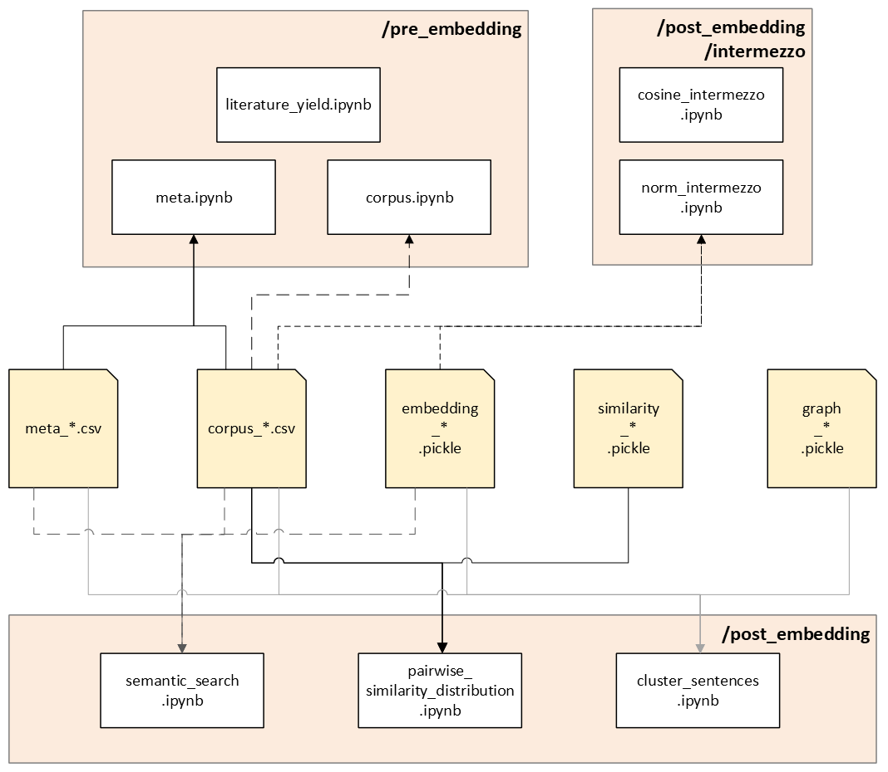

**Open Knowledge Explorer**

Please find the github page containing [the code over here](https://github.com/CharmingChocobo/master_graduation_project/tree/main) and
check out [this extensive documentation page](https://bioinf.nl/~jbeenen/oke/html/index.html).

## About this project
The Open Knowledge Explorer (OKE) was developed as a modular text-mining pipeline designed to capture full open-access scientific publications by extracting and embedding their sentences, preserving provenance, and constructing a cosine similarity graph for downstream analysis.

## How to use
- Create an venv and install the libraries. Please find used Python version and libraries in the section 'Software requirements'.
- Change the filename of `config_template.yaml` to `config.yaml`, and change the variables accordingly.
- Change settings in `main_part1.sh` and `main_part2.sh` (note "SETTINGS" in scripts):

```bash
experiment_name="251013_pest_PD"
search_mode="free"  # "free" or "concept"
nr_pmids=1000

venv_path=~/venv/graduation_3_13_5
config_file="config.yaml"

sbert_model="NeuML/pubmedbert-base-embeddings" # Only applicable for main_part2.sh
```

- Make sure they both use the same settings and check if pipes of interest are active.  
- For `main_part2.sh` Take extra care in checking the `#SBATCH` directory paths and job-name:

```bash
#SBATCH --job-name your_name_sbert
#SBATCH --account kcbbe
#SBATCH --chdir /homes/your_name/git-repo/
```

- If `scripts/pdf2xml.py` is active in `main_part1.sh`; make sure to activate the GROBID server in an separate window by running `bash start_grobid_a19.sh` first, before running `main_part1.sh`. (Check with `curl <servername>:<portname>` if GROBID is alive.)

**NOTE: There are two separate 'main' scripts. `main_part1.sh` runs on assemblix2019 (CPU heavy) and `main_part2.sh` runs on assemblix2025 (GPU heavy). For GROBID to work, run `start_grobid_a19.sh` on the same device as `main_part1.sh` will be running.**

- Run the application by entering `bash main_part1.sh && sbatch main_part2.sh` in the terminal. Log files will be created and can be found in `logs/`.
  
**WARNING: Path to where data will be written (`data/`) is currently hard-coded. Make sure that there is enough disk space to avoid disappointments. Please view section 'Storage requirements' in this readme for more information.**

- Use the jupyter notebooks in folder `explorations` to analyze created sentence embedding, similarity scores, and networkx graph. Note that these notebooks contain code that is specific for our "Parkinson's - Pesticide" research question. Please modify the code as you see fit.

## Configuration
Please use `config.yaml` to modify the configuration. Note that the parenthesis denotes for which script they are required.
  
## Reproduce results from thesis
To reproduce the results from the thesis, several files are already found in the `data/` folder. Except for the embedding, similarity, and graph files, please find these in my [Teams](https://hanzenl.sharepoint.com/:f:/s/Afstudeerstage2/IgDONvNvwi7jRqHG42folCzpAUEiV7Z0Y-ybKjZvlQ_wPgU?e=AuYZea) environment.
(`Afstudeerstage - Jennefer/Documents/General/Code repository (0.25)/example files`)

## Folder structure
**Initial structure**
```bash
.
├── data/ [optional]concepts/concept_ids.txt
├── docs/
├── explorations/
│   ├──pre_embedding/
│   │   ├── corpus.ipynb
│   │   ├── meta.ipynb
│   │   └── literature_yield.ipynb
│   ├──post_embedding/
│   │   ├── intermezzo/ 
│   │   │   ├── cosine_intermezzo.ipynb
│   │   │   └── norm_intermezzo.ipynb
│   │   ├── cluster_sentences.ipynb
│   │   ├── semantic_search.ipynb
│   │   └── sentence_pairs.ipynb
├── scripts/
│   ├── concept2pmid.py
│   ├── corpus_by_sentence2vector.py
│   ├── meta2pdf.py
│   ├── pdf2xml.py
│   ├── pmid2meta.py
│   ├── similarity2graph.py
│   └── xml2corpus_by_sentence.py
├── logs/
├── config.yaml
├── start_grobid.sh
├── main_part1.sh
└── main_part2.sh
```
In `data/` the following new folders will be created; corpus, graphs, meta, pdf_papers, pmids, vectors, and xml_papers. Various log files will be created and are found in `logs/`. In `exploration/` the data in `data/` can be explored/analyzed, as well as creating a Sankey diagram of papers that made it to the corpus by manually entering the numbers found in one of the log files (`pre_embedding/literature_yield.ipynb`).

## Software requirements
- Python: version 3.13.5, see `requirements.txt` for required libraries.
(Please check out [this gitbook](https://jennefer.gitbook.io/back-to-basic/initialize-project/create-a-new-python-venv) on how to create a virtual environment and quick install required libraries.)
- Podman: podman version 4.3.1
- GROBID: lfoppiano/grobid:0.8.1 
- Sphinx: version 8.2.3

## Hardware requirements
It is recommended to have at least 6.0 GB space available in the storage medium.
Of all the folders in this pipeline, `data/` will be the largest regarding disk usage, where the similarity matrix (`similarity_*.pickle`) in `data/vectors/` will take most space. As an indication, a corpus with 30,483 sentences of 152 papers will generate a similarity matrix of ~3.5 GB.

## Flowchart


Flowchart of the OKE pipeline. Orange boxes represent shell scripts that execute multiple Python scripts. The initial input, shown in grey, is either a concept file or a free-text search term. Various files are generated by these scripts, where an asterisk denotes the experiment name. Error files are shown in red, while files in yellow are subsequently used by notebooks located in /explorations for further analysis.

## Exploratory notebooks


Overview of the OKE pipeline relevant outputs (yellow, as shown in Figure 4) and the associated Jupyter notebooks (white). Arrows indicate the dependencies between outputs and notebooks, while orange rectangles denote folder locations.

The notebooks are organised into two categories: pre-embedding and post-embedding. The pre-embedding notebooks include `literature_yield.ipynb`, which generates a Sankey diagram to visualise literature yield; `meta.ipynb`, which describes the properties of the retrieved literature forming the corpus; and `corpus.ipynb`, which describes sentence content and properties, paper-level attributes, and header name distributions within the corpus.
The post-embedding notebooks include `semantic_search.ipynb`, which enables retrieval of the top five most relevant sentences in response to a user query; `pairwise_similarity_distribution.ipynb`, which identifies pairs of sentences with the highest similarity and characterises the distribution of these pairs; and `cluster_sentences.ipynb`, which groups sentences into clusters based on cosine similarity scores and characterises their properties and content.

Additionally, a subfolder named intermezzo contains two notebooks: `cosine_intermezzo.ipynb`, which explains the calculation of cosine similarity scores, and `norm_intermezzo.ipynb`, which explores properties associated with the norm of a sentence vector.

## Sources
TenWise. (no date). Introduction – KMAP API 1 documentation. Retrieved January 14, 2026, from https://apimlqv2.tenwiseservice.nl/html/index.html

Priem, J., Piwowar, H., & Orr, R. (2022). OpenAlex: A fully-open index of scholarly works, authors, venues, institutions, and concepts. ArXiv. https://arxiv.org/abs/2205.01833

GROBID (2008-2025) <https://github.com/kermitt2/grobid>. Github. Retrieved January 14, 2026, from https://grobid.readthedocs.io/

Reimers, N., & Gurevych, I. (2019). Sentence-BERT: Sentence Embeddings using Siamese BERT-Networks. EMNLP-IJCNLP 2019 - 2019 Conference on Empirical Methods in Natural Language Processing and 9th International Joint Conference on Natural Language Processing, Proceedings of the Conference, 3982–3992. https://doi.org/10.18653/V1/D19-1410

## AI usage
All code was written by the author unless stated otherwise. Microsoft Copilot (version 1.7.4421) was used to support the creation of docstrings and the generation of regular expressions for sentence extraction. It is explicitly indicated in the corresponding comments where code was generated by Copilot.
